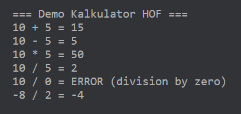

# Latihan 1 — Kalkulator Operasi (Higher-Order Function)
- Zaqia Mahadewi (235150201111001)
- Syafa Syakira Shalsabilla (235150201111006)

Fungsi applyOperation dirancang sebagai sebuah Higher-Order Function. Fungsi ini tidak melakukan perhitungan secara langsung, tetapi menerima dua buah bilangan integer dan sebuah fungsi operasi sebagai parameter. Untuk mendefinisikan operasi penjulahan (add), pengurangan (sub), perkalian (mul), dan pembagian (div), kami memanfaatkan Lambda Expression. Penggunaan lambda memungkinkan penulisan logika operasi secara ringkas tanpa mendeklarasikan fungsi formal menggunakan kata kunci fun berkali-kali. Setiap lambda ini memiliki tanda fungsi (Int, Int) -> Int, yang berarti mereka menerima dua input integer dan mengembalikan satu hasil integer.

Untuk penanganan edge case pada operasi pembagian (div), kami menerapkan strategi pengecekan kondisi. Jika angka pembagi (y) bernilai nol, maka fungsi tidak akan memaksakan pembagian yang bisa menyebabkan crash, melainkan akan mengembalikan nilai 0. Program demo dilengkapi dengan logika tambahan yang akan menangkap hasil tersebut dan menampilkan pesan "ERROR (division by zero)" pada konsol. 

Sebagai pembuktian fungsi, kami menyusun sebuah program demo yang menjalankan minimal 6 uji kasus berbeda. Pengujian ini mencakup operasi aritmatika normal seperti 10 + 5, penggunaan angka negatif seperti -8 / 2, hingga pengujian pembagian dengan nol. Seluruh data uji ini disimpan menggunakan struktur data class agar proses iterasi dan penampilan output menjadi rapi dan mudah dibaca sesuai dengan standar deliverable yang diminta. Berikut adalah tampilan output dari kode program.

